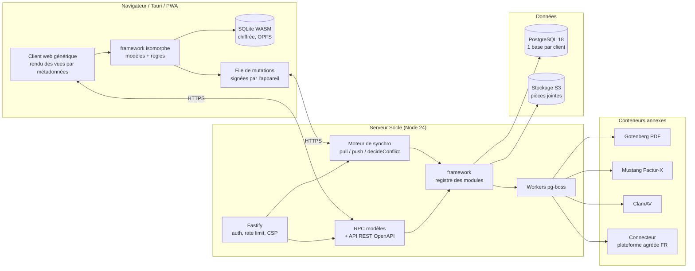

# Socle ERP — Document d'architecture

> **Nom de code provisoire** : `socle-erp` (renommable après vérification INPI / INAPI).
> **Version du document** : 1.0 — 27 septembre 2026
> **Auteur** : Mohamed (Bio Interaction Algérie) — rédigé avec Claude
> **Statut** : référence unique pour le développement. Toute décision qui s'en écarte passe par un ADR (`docs/adr/`).

---

## 0. Décisions actées

| # | Sujet | Décision | Conséquence principale |
|---|---|---|---|
| D1 | Distribution | **SaaS hébergé + auto-hébergeable** (comme Odoo) | Une base PostgreSQL par client ; image Docker identique pour les deux modes |
| D2 | Licence du cœur (80 %) | **LGPL-3.0-only** (comme Odoo Community) | Modules propriétaires autorisés par la licence elle-même ; CLA recommandé (voir §11) |
| D3 | Licence des modules payants (20 %) | **Propriétaire** (`LicenseRef-Socle-Pro`) | Dépôt privé séparé, clés de licence signées |
| D4 | Compte GitHub | **`Mehdi-afk`** — `socle-erp` (public) + `socle-erp-pro` (privé) | Dépôts créés en phase 0, avant toute ligne de code |
| D5 | Langage | **TypeScript de bout en bout** (justification §2) | Même définition de modèle côté serveur et côté client hors ligne |
| D6 | Périmètre V1 | **Socle + gestion commerciale** : Contacts, Produits, Ventes, Achats, Stock, Facturation, localisations FR et DZ | Premier produit vendable à une PME |
| D7 | Hors ligne | **Offline-first sur toute l'application** | Moteur de synchronisation conçu dès la phase 1, pas ajouté après |
| D8 | Modules payants | **IA souveraine**, **Flotte & Location**, **Santé**, **Pack Données Pro** | Tous issus de projets déjà réalisés (§5) |
| D9 | Principe commercial | **La conformité légale et la sécurité ne sont jamais payantes** | Factur-X, FEC, ISCA, MFA, SSO restent dans le cœur LGPL |
| D10 | Écosystème | **Les intégrateurs tiers peuvent vendre leurs propres modules payants**, comme sur l'Odoo Apps Store | Permis directement par la LGPL ; API publique stable et versionnée, marketplace (§11 bis) |

---

## 1. Vision

Un ERP modulaire inspiré d'Odoo, pensé **d'abord pour les PME françaises** et **nativement adapté à l'Algérie**, qui se distingue sur quatre points qu'aucun concurrent ne réunit :

1. **Fonctionne sans réseau**, partout — pas seulement en caisse.
2. **Localisation algérienne complète et gratuite** (SCF, TVA 19/9 %, droit de timbre, NIF/NIS/RC/AI, CNAS/CASNOS, arabe RTL), à côté d'une localisation française à jour de la réforme de facturation électronique.
3. **Trilingue natif FR / EN / AR** (droite-à-gauche géré par le design system, pas en rustine).
4. **Verticales métier éprouvées sur le terrain** (flotte, santé, import de données, IA locale) venues de projets réellement livrés.

### Principe fondateur : réutiliser, jamais réécrire

Comme Odoo, un module ne copie jamais le code d'un autre : il **l'étend**. Quatre mécanismes le permettent (détail §4) :

| Mécanisme | Ce qu'on fait | Équivalent Odoo |
|---|---|---|
| Extension de modèle | Ajouter des champs / surcharger une méthode en appelant `super` | `_inherit = 'sale.order'` |
| Héritage par prototype | Créer un nouveau modèle qui copie la structure d'un autre | `_inherit` + nouveau `_name` |
| Délégation | Un modèle en « contient » un autre (ex. un employé *a* un contact) | `_inherits` |
| Extension de vue | Insérer / masquer / modifier un élément d'une vue existante par sélecteur | héritage de vues XML + `xpath` |

S'y ajoutent les **mixins** (`mail.thread`, `sequence.mixin`, `archivable`…) et un **client web générique** qui affiche n'importe quel modèle à partir de ses métadonnées : un nouveau module n'écrit en général **aucun écran React**.

---

## 2. Comparatif des langages et choix de la stack

### 2.1 Critères et pondération

| Critère | Poids | Pourquoi |
|---|---|---|
| Extensibilité type Odoo (composition dynamique de modèles, chargement de modules) | 20 | C'est le cœur du projet |
| **Isomorphie client/serveur pour l'offline-first** | 20 | Décision D7 : la logique métier doit tourner aussi dans le navigateur |
| Robustesse (typage, refactoring sûr) | 15 | Un ERP vit 15 ans |
| Écosystème ERP / conformité (PDF, Excel, Factur-X, compta) | 10 | Coût de ce qu'il faut construire soi-même |
| Sécurité et outillage (SAST, chaîne d'approvisionnement) | 10 | Voir §9 |
| Performance | 5 | Un ERP PME est rarement limité par le CPU |
| Recrutement / contributeurs FR et DZ | 10 | Projet open source |
| Maîtrise actuelle + productivité avec Claude Code | 10 | Tu développes seul avec Claude Code au départ |

### 2.2 Notation (1 à 5)

| Critère (poids) | **TypeScript** | Python | Java / Kotlin | C# / .NET | PHP | Go |
|---|---|---|---|---|---|---|
| Extensibilité type Odoo (20) | 4 | **5** | 3 | 3 | 4 | 2 |
| Offline-first isomorphe (20) | **5** | 2 | 3 | 3 | 2 | 2 |
| Robustesse / typage (15) | 4 | 3 | **5** | **5** | 3 | 4 |
| Écosystème ERP (10) | 3 | **5** | 4 | 4 | 3 | 2 |
| Sécurité / outillage (10) | 3 | 4 | **5** | **5** | 3 | **5** |
| Performance (5) | 4 | 3 | **5** | **5** | 3 | **5** |
| Recrutement FR/DZ (10) | **5** | 4 | 4 | 3 | **5** | 2 |
| Maîtrise + Claude Code (10) | **5** | 3 | 2 | 2 | 2 | 2 |
| **Score /100** | **84** | 72 | 74 | 72 | 62 | 55 |

### 2.3 Lecture du comparatif

| Langage | Force décisive | Faiblesse décisive | Référence du marché |
|---|---|---|---|
| **TypeScript** | Le même code de modèle tourne sur le serveur (Node) **et** dans le navigateur hors ligne (SQLite WASM). Un seul langage, typage strict, ta stack actuelle | Chaîne d'approvisionnement npm exposée (attaques de 2025) ; bibliothèques Factur-X moins mûres | — (c'est l'opportunité) |
| Python | L'héritage dynamique d'Odoo est naturel ; bibliothèques Factur-X et compta mûres | L'offline-first imposerait de **réécrire toute la logique métier en JS** côté client : exactement ce qu'on veut éviter | Odoo, ERPNext, Tryton |
| Java / Kotlin | Le plus robuste, excellent outillage de sécurité ; Kotlin Multiplatform peut partager une partie de la logique avec le client | Lourd, lent à développer seul, partage client/serveur partiel et complexe | Axelor (AGPL, français) |
| C# / .NET | Robuste, framework modulaire ABP | Communauté plus faible en Algérie ; Blazor WASM lourd hors ligne | — |
| PHP | Très répandu en Algérie, hébergement mutualisé | Offline impossible sans réécrire en JS ; typage faible | Dolibarr (GPL, français) |
| Go | Performance, binaire unique, sûreté | Pas de chargement dynamique de modules digne de ce nom | — |

> **Décision : TypeScript de bout en bout.** Le critère qui départage est l'offline-first : avec Python (le choix « naturel » pour copier Odoo), chaque règle métier devrait exister deux fois — en Python sur le serveur, en JavaScript dans le navigateur. C'est l'inverse du principe « réutiliser au lieu de réécrire ».
>
> **Compensations prévues** : chaîne d'approvisionnement verrouillée (§9.4) ; argent en entiers de centimes (pattern Bio Réactifs) + `decimal.js` pour les taux ; Factur-X délégué à un service spécialisé en conteneur (§3.4).

### 2.4 Stack retenue

| Couche | Choix | Raison |
|---|---|---|
| Runtime serveur | **Node.js 24 LTS** | LTS, TypeScript exécutable nativement pour les scripts |
| Framework HTTP | **Fastify 5** | Système de plugins, validation par schéma, performant |
| Base de données | **PostgreSQL 18** — une base par client | Isolation forte, sauvegarde/export par client (modèle Odoo) |
| Accès aux données | **Kysely** (query builder typé) sous un **ORM maison** piloté par métadonnées | Prisma/Drizzle imposent un schéma statique : incompatible avec des modules qui ajoutent des champs à l'installation |
| Validation | **Zod 4**, schémas générés depuis les modèles | Une seule source de vérité |
| Tâches de fond | **pg-boss** (file dans PostgreSQL) | Zéro dépendance supplémentaire en auto-hébergement |
| Client web | **React 19 + Vite + TanStack Router/Query + Tailwind v4 + Radix/shadcn** | SPA/PWA ; pas de Next.js (le SSR n'apporte rien à un client offline-first) |
| Base locale (client) | **SQLite WASM sur OPFS** dans un Web Worker, chiffrée (SQLite3 Multiple Ciphers — à valider en *spike*) | Même moteur de requêtes que Bio Réactifs, FTS5 disponible |
| Bureau / caisse | **Tauri 2** (phase 5) | Plus léger et plus sûr qu'Electron (permissions par capacités) |
| Mobile | PWA installable, puis **Capacitor** si besoin natif | Un seul code |
| Recherche | PostgreSQL FTS (`french`, `simple` pour l'arabe) + `pg_trgm` | Pas de moteur externe |
| Fichiers | Stockage **S3-compatible** (OVH / Scaleway en SaaS, Garage ou SeaweedFS en auto-hébergé) | URL signées, jamais servis depuis le disque web |
| PDF | Modèles HTML → **Gotenberg** (Chromium en conteneur) | Rendu fidèle, isolé du serveur applicatif |
| Factur-X | Service **Mustang** (open source, Apache-2.0) en conteneur : génération PDF/A-3 + validation | Référence du marché franco-allemand |
| Excel | **ExcelJS** (formules vivantes, pattern Bio Réactifs) | — |
| Observabilité | **OpenTelemetry** + logs `pino` avec masquage des données personnelles | — |
| Monorepo | **pnpm workspaces + Turborepo** | Pattern FleetOra (`packages/shared`) généralisé |
| Tests | **Vitest**, PostgreSQL réel en conteneur jetable (utilitaire maison `@socle/testing`, ADR 010), **Playwright**, **fast-check** (tests de propriétés de la synchro) | — |

---

## 3. Architecture générale

### 3.1 Vue d'ensemble



### 3.2 Structure du monorepo (`Mehdi-afk/socle-erp`, LGPL)

```
socle-erp/
├── apps/
│   ├── server/            # Fastify : HTTP, RPC, auth, synchro, résolution du client (tenant)
│   ├── worker/            # tâches de fond pg-boss (PDF, emails, e-facturation, imports)
│   ├── web/               # client web générique, PWA, service worker
│   ├── desktop/           # Tauri 2 — caisse, impression silencieuse, périphériques (phase 5)
│   └── cli/               # socle : db create/drop/backup, module install/upgrade, scaffold, assets
├── packages/
│   ├── framework/         # ⚙️ NOYAU ISOMORPHE — aucune dépendance Node ni DOM
│   │   ├── registry/      #   chargement des manifestes, tri topologique, composition des modèles
│   │   ├── orm/           #   champs, calculés, contraintes, domaines de recherche, environnement
│   │   ├── security/      #   ACL, règles d'enregistrement, groupes (fonctions pures)
│   │   ├── views/         #   définition et héritage des vues
│   │   └── i18n/
│   ├── orm-pg/            # adaptateur PostgreSQL (Kysely) + génération de schéma + migrations
│   ├── orm-sqlite/        # adaptateur SQLite WASM (client hors ligne)
│   ├── sync/              # journal de mutations, curseurs, decideConflict() PUR
│   ├── ui/                # design system : tokens, composants, RTL, mode sombre
│   ├── view-engine/       # rendu React des vues form / list / kanban / calendar / pivot / graph
│   ├── crypto/            # argon2id, signatures Ed25519, chaîne de hachage d'audit
│   ├── licensing/         # vérification HORS LIGNE des clés Pro (le code est public, la clé privée non)
│   └── testing/           # fabriques, fixtures, base éphémère
├── modules/               # modules community (LGPL)
├── docs/
│   ├── ARCHITECTURE.md    # ce document
│   ├── adr/               # décisions d'architecture numérotées
│   ├── security/          # modèle de menace, procédures, plan de réponse à incident
│   └── modules/           # documentation par module
├── deploy/
│   ├── compose/           # docker compose auto-hébergement (Caddy TLS auto)
│   └── images/            # Dockerfiles (distroless, non-root)
├── .github/               # workflows, rulesets, modèles d'issues, CODEOWNERS
├── CLAUDE.md              # règles pour Claude Code
├── LICENSE                # LGPL-3.0 (+ COPYING : texte GPL-3.0 auquel la LGPL renvoie)
├── SECURITY.md
├── CONTRIBUTING.md
└── CLA.md
```

Le dépôt privé **`Mehdi-afk/socle-erp-pro`** a la même forme (`modules/` + `docs/`) et consomme le cœur comme dépendance versionnée (paquets `@socle/*` publiés sur GitHub Packages ; sous-module Git épinglé sur un tag pendant le développement).

### 3.3 Anatomie d'un module

```
modules/sale/
├── manifest.ts              # identité, dépendances, licence, édition, capacités hors ligne
├── models/
│   ├── sale-order.ts        # nouveaux modèles
│   └── res-partner.ext.ts   # extensions de modèles d'autres modules (suffixe .ext obligatoire)
├── views/
│   ├── sale-order.views.ts
│   └── res-partner.views.ext.ts
├── security/
│   ├── access.ts            # droits CRUD par groupe (équivalent ir.model.access)
│   └── rules.ts             # règles d'enregistrement (équivalent ir.rule)
├── data/                    # séquences, paramètres, données de référence (chargées à l'installation)
├── demo/                    # données de démonstration (jamais en production)
├── i18n/                    # fr.json, en.json, ar.json
├── migrations/<version>/    # pre.ts / post.ts pour les changements destructifs
├── reports/                 # modèles d'impression
├── ui/                      # widgets React spécifiques (rarement nécessaires)
└── tests/
```

### 3.4 Services annexes

| Service | Rôle | Isolation |
|---|---|---|
| Gotenberg | HTML → PDF | Réseau interne uniquement, pas d'accès Internet sortant |
| Mustang | Génération PDF/A-3 Factur-X + validation EN 16931 | Idem |
| ClamAV | Analyse antivirus des fichiers déposés | Idem |
| Connecteur PA | Transmission / réception des factures via la plateforme agréée choisie par le client | Seul service autorisé à sortir, vers une liste blanche d'hôtes |
| Caddy | Reverse proxy, TLS automatique, en-têtes de sécurité | Seul exposé à Internet |

---

## 4. Le framework : comment on réutilise au lieu de réécrire

### 4.1 Manifeste

```ts
// modules/sale/manifest.ts
export default defineManifest({
  name: 'sale',
  version: '1.0.0',
  label: { fr: 'Ventes', en: 'Sales', ar: 'المبيعات' },
  category: 'Ventes',
  depends: ['base', 'contacts', 'product', 'account'],
  license: 'LGPL-3.0-only',
  edition: 'community',          // 'community' | 'pro'
  application: true,             // apparaît dans le sélecteur d'applications
  autoInstall: false,            // true = s'installe dès que toutes ses dépendances le sont (modules « pont »)
  offline: { syncable: true },   // ses modèles sont synchronisables par défaut
  engines: { socle: '^1.0' },    // versions du cœur supportées (obligatoire sur la marketplace)
  capabilities: [],              // ex. ['sudo', 'cron', 'files', { network: ['api.exemple.fr'] }] — appliqué à l'exécution
});
```

### 4.2 Définir un modèle

```ts
// modules/sale/models/sale-order.ts
export default defineModel({
  name: 'sale.order',
  description: { fr: 'Commande client', en: 'Sales order', ar: 'طلب بيع' },
  mixins: ['mail.thread', 'sequence.mixin', 'company.scoped'],
  fields: {
    name:          f.char({ required: true, readonly: true, default: '/' }),
    partnerId:     f.many2one('res.partner', { required: true, index: true }),
    lines:         f.one2many('sale.order.line', 'orderId'),
    currencyId:    f.many2one('res.currency', { required: true }),
    amountUntaxed: f.monetary({ compute: 'computeAmounts', store: true, depends: ['lines.priceSubtotal'] }),
    state:         f.selection(
                     [['draft', 'Brouillon'], ['sent', 'Envoyé'], ['sale', 'Confirmé'], ['cancel', 'Annulé']],
                     { default: 'draft', tracking: true }),
  },
  offline: { conflict: 'field-lww' },

  // Méthodes ISOMORPHES : s'exécutent sur le serveur ET hors ligne dans le navigateur
  methods: (Base) => class extends Base {
    computeAmounts() {
      for (const order of this) order.amountUntaxed = sumMoney(order.lines.map(l => l.priceSubtotal));
    }
  },

  // Méthodes SERVEUR : jamais exécutées hors ligne ; mises en file et jouées à la synchro
  serverMethods: (Base) => class extends Base {
    async actionConfirm() {
      this.ensureState('draft', 'sent');
      await this.assignLegalNumber();   // numérotation légale : toujours côté serveur
      this.state = 'sale';
    }
  },
});
```

### 4.3 Étendre un modèle depuis un autre module

```ts
// modules/sale_margin/models/sale-order.ext.ts
export default extendModel('sale.order', {
  fields: {
    margin: f.monetary({ compute: 'computeMargin', store: true, depends: ['lines.margin'] }),
  },
  methods: (Base) => class extends Base {
    computeMargin() { for (const o of this) o.margin = sumMoney(o.lines.map(l => l.margin)); }
  },
  serverMethods: (Base) => class extends Base {
    async actionConfirm() {
      this.assertMarginPolicy();      // on ajoute un contrôle…
      return super.actionConfirm();   // …et on RÉUTILISE le comportement existant
    }
  },
});

// Typage : le compilateur connaît le nouveau champ partout (ADR 009 : clé = nom du module,
// car plusieurs modules peuvent étendre le même modèle ; le module qui DÉFINIT sale.order
// déclare, lui, `interface ModelFields { 'sale.order': FieldsOf<typeof saleOrder> }`)
declare module '@socle/framework' {
  interface ModelExtensions { sale_margin: { 'sale.order': { margin: Money } } }
}
```

### 4.4 Construction du registre (au démarrage et à chaque installation)

1. Lire la table `ir_module` de la base du client → liste des modules **installés**.
2. **Tri topologique** des dépendances ; échec explicite en cas de cycle ou de dépendance manquante.
3. Pour chaque nom de modèle : prendre la définition, puis appliquer les extensions **dans l'ordre des dépendances** → composition de classes `extN(…ext2(ext1(Base)))`. `super` fonctionne naturellement.
4. Fusion des champs ; **conflit = erreur au chargement** (deux modules qui redéfinissent le même champ avec des types incompatibles).
5. Compilation des ACL, des règles d'enregistrement et des vues héritées.
6. Calcul du **différentiel de schéma** et application (§4.7).
7. Publication d'un **instantané de registre** (métadonnées des modèles, vues, menus, traductions) filtré par les droits de l'utilisateur, consommé par le client web.

### 4.5 Vues déclaratives et héritage de vues

```ts
// modules/sale/views/sale-order.views.ts
export const saleOrderForm = defineView({
  id: 'sale.order.form', model: 'sale.order', type: 'form',
  arch: form([
    header([button('actionConfirm', { label: 'Confirmer', states: ['draft', 'sent'], primary: true })]),
    group([field('partnerId'), field('currencyId')]),
    notebook([page('lines', 'Lignes', [field('lines', { widget: 'editable-list' })])]),
    group({ name: 'totals' }, [field('amountUntaxed')]),
  ]),
});

// modules/sale_margin/views/sale-order.views.ext.ts
export default extendView('sale.order.form', [
  { at: "group[name='totals'] > field[name='amountUntaxed']", position: 'after',
    node: field('margin', { groups: ['sale.group_manager'] }) },
]);
```

Positions : `before`, `after`, `inside`, `replace`, `attributes`. Un sélecteur qui ne trouve rien = **erreur à l'installation**, jamais un échec silencieux. Types de vues : `form`, `list`, `kanban`, `calendar`, `pivot`, `graph`, `search`, `gantt` (phase 5), `map` (phase 5).

### 4.6 Types de champs

`char`, `text`, `html` (assaini par DOMPurify — pattern BioInteraction), `integer`, `decimal`, `monetary` (**entier en unités mineures + devise**, pattern Bio Réactifs), `boolean`, `date`, `datetime` (UTC en base), `selection`, `many2one`, `one2many`, `many2many`, `binary` (référence S3), `json`, `reference`. Attributs communs : `required`, `readonly`, `index`, `default`, `compute` + `depends` + `store`, `related`, `groups` (visibilité par groupe), `tracking` (historisé dans le chatter), `translate`, `sensitive` (chiffré au repos, masqué dans les logs), `offline: false` (jamais synchronisé).

### 4.7 Schéma et migrations

| Changement | Traitement |
|---|---|
| Nouveau modèle, nouveau champ, nouvel index | **Automatique** à l'installation / mise à jour |
| Renommage, changement de type, suppression | **Uniquement** via `migrations/<version>/pre.ts` ou `post.ts` écrits à la main |
| Toute installation, mise à jour ou désinstallation | **Instantané préalable obligatoire** de la base (pattern Bio Réactifs : `avant-installation`, `avant-mise-a-jour`, `avant-import`…) avec chemin de restauration renvoyé en cas d'échec |
| Désinstallation | Export de sauvegarde des données du module, puis suppression, en **une transaction** |

Table de version par module (pas d'introspection bricolée — erreur relevée dans Bio Réactifs).

### 4.8 Sécurité intégrée au framework

- **ACL** par modèle et par groupe (lecture / création / écriture / suppression), **refus par défaut**.
- **Règles d'enregistrement** exprimées en domaines (`[['companyId', 'in', user.companyIds]]`) compilées en `WHERE` SQL **et** en filtres SQLite côté client.
- **Défense en profondeur** : RLS PostgreSQL sur les tables sensibles, alimentée par `SET LOCAL app.user_id` à chaque transaction.
- Les permissions sont des **fonctions pures testables** (pattern FleetOra `canAccessView` / `canWrite`).
- Tout accès *sudo* est explicite (`env.sudo()`), journalisé, et interdit depuis le client.

### 4.9 API

| API | Usage | Détails |
|---|---|---|
| RPC interne `POST /rpc/:model/:method` | Client web | `search`, `read`, `searchRead`, `create`, `write`, `unlink`, méthodes métier publiques (décorées `@public`) — schémas Zod générés |
| REST `/api/v1` | Intégrations tierces | OpenAPI 3.1 générée, clés d'API à portée limitée, OAuth2 *client credentials* |
| Synchro `/sync/pull`, `/sync/push` | Client hors ligne | §6 |
| Webhooks sortants | Intégrations | Signés HMAC-SHA256, rejouables, liste blanche d'URL |

---

## 5. Catalogue des modules

### 5.1 Ce que ta base de connaissances apporte (et que les concurrents n'ont pas)

| Brique déjà réalisée | Projet d'origine | Ce qu'Odoo / Dolibarr / Axelor proposent | Destination |
|---|---|---|---|
| Politique de synchro « le plus récent gagne, **rien n'est détruit sans archive** », décision pure et testable | FleetOra (`sync-policy.ts`) | Odoo : hors ligne limité à la caisse | **Cœur** — moteur offline-first |
| Multi-utilisateur par entité + rôles en fonctions pures | FleetOra | Existe, mais dispersé | **Cœur** — framework de sécurité |
| UPSERT non destructif (`COALESCE(NULLIF(excluded.x,''), x)`), instantané avant opération, transaction unique | Bio Réactifs | Import Odoo : une cellule vide écrase la donnée | **Cœur** (import de base) + Pro |
| Import Excel en 4 étapes, mapping flou (synonymes + Levenshtein proportionnel) **mémorisé par fournisseur**, aperçu différentiel avant/après | Bio Réactifs | Mapping manuel, pas d'aperçu différentiel | **Pro — Pack Données** |
| Classement automatique de PDF en vrac vers les bons enregistrements | Bio Réactifs | Absent | **Pro — Pack Données** |
| Liasses PDF (page de garde + fusion de documents hétérogènes, fichiers illisibles signalés) | Bio Réactifs | Absent | **Pro — Pack Données** |
| Exports Excel à **formules vivantes** et modèles d'export personnalisés | Bio Réactifs | Export à valeurs figées | **Pro — Pack Données** |
| Contrats de location (jours × tarif + km au-delà du forfait), clôture au km retour, 2ᵉ conducteur, calendrier hebdo de flotte, conversion réservation → contrat | FleetOra | Odoo Fleet : suivi de parc, pas de location | **Pro — Flotte & Location** |
| Échéancier **double critère date ET kilométrage**, alertes contrôle technique / assurance, infractions imputées au véhicule, rentabilité par véhicule et par propriétaire tiers | FleetOra | Absent | **Pro — Flotte & Location** |
| Analyses médicales, parapharmacie, véhicules sanitaires, suivi CNAS | Cabinet Médical | Absent (modules tiers) | **Pro — Santé** |
| Suivi client par **QR code** (commande, intervention, dossier) | Cabinet Médical | Absent | **Cœur** (`tracking_qr`) |
| RH + paie Algérie (contrats, congés, CNAS/CASNOS, IRG) | Cabinet Médical | `l10n_dz` Odoo très partiel | **Cœur** (`l10n_dz_hr`, phase 5) |
| Wilayas / communes, métiers, validation des téléphones DZ | BioInteraction, FleetOra | Absent | **Cœur** (`l10n_dz`) |
| Portail B2B : validation administrateur + OTP email, proforma générée par le client, mini-CRM | HSInformatique | Portail sans proforma libre-service | **Cœur** (`portal`, `portal_b2b`) |
| Caisse : favoris sans code-barres, douchette, rendu monnaie, bilan journalier, PIN caissier | POS Alimentation | Existe (Odoo POS) | **Cœur** (`pos`, phase 5) |
| Assistant IA **100 % local** : RAG + MCP, aucune donnée ne sort | Goodman | IA via API cloud | **Pro — IA souveraine** |
| Edge functions mutualisées (CORS → rate limit → parse → validate → auth → action) | BioInteraction | — | **Cœur** — ordre de traitement de chaque requête |
| Sauvegardes horodatées à label sémantique + rétention + restauration réversible | Bio Réactifs | Sauvegarde manuelle | **Cœur** (`backup`) |
| Analytics produit / tunnel de conversion | FleetOra | — | Interne (SaaS) |

### 5.2 Modules community (LGPL) — par phase

| Module | Contenu | Phase |
|---|---|---|
| `base` | Sociétés (multi-sociétés), utilisateurs, groupes, ACL, règles, séquences, devises, pays, paramètres, journal d'audit | 2 |
| `web` | Client générique, menus, actions, préférences, sélecteur de langue FR/EN/AR | 2 |
| `mail` | Chatter, historique des champs suivis, activités, notifications, emails entrants/sortants | 2 |
| `contacts` | Partenaires (personnes/sociétés), adresses, identifiants légaux (SIREN/SIRET, TVA intracom, NIF/NIS/RC/AI) | 2 |
| `product`, `uom` | Articles, variantes, unités, catégories, codes-barres | 2 |
| `backup` | Instantanés à label sémantique, rétention, restauration réversible | 2 |
| `import_base` | Import CSV/Excel standard avec UPSERT non destructif et instantané préalable | 2 |
| `sale` | Devis, commandes, listes de prix, remises | 3 |
| `purchase` | Demandes de prix, commandes fournisseurs, réceptions | 3 |
| `stock` | Entrepôts, emplacements, **mouvements append-only**, lots/séries, inventaires | 3 |
| `account` | Facturation, avoirs, paiements, journaux, plan comptable, lettrage | 3 |
| `l10n_fr` | PCG, TVA (20 / 10 / 5,5 / 2,1 %), **FEC**, mentions obligatoires 2026, **Factur-X / UBL / CII**, connecteur PA, e-reporting | 3 |
| `l10n_dz` | **SCF**, TVA 19 / 9 %, **droit de timbre** (barème versionné), NIF/NIS/RC/AI, wilayas/communes, DZD, factures bilingues FR/AR, exports déclaratifs (G50) | 3 |
| `portal`, `portal_b2b` | Portail client : devis, factures, commandes ; B2B avec validation + OTP + proforma | 3 |
| `tracking_qr` | Suivi public par QR code signé (sans données personnelles exposées) | 4 |
| `crm`, `project`, `maintenance` | Pistes, projets/tâches, maintenance simple | 5 |
| `pos` | Caisse offline, conforme ISCA (inaltérabilité, sécurisation, conservation, archivage) | 5 |
| `hr`, `l10n_dz_hr`, `l10n_fr_hr` | Dossiers, contrats, congés ; paie DZ (CNAS/CASNOS/IRG) ; paie FR hors périmètre initial (DSN = chantier à part) | 5 |

### 5.3 Modules Pro (propriétaires, dépôt `socle-erp-pro`)

| Pack | Modules | Dépend de | Remarque réglementaire |
|---|---|---|---|
| **Pack Données Pro** | `pro_smart_import`, `pro_docs_autoclassify`, `pro_pdf_bundle`, `pro_excel_live` | `base`, `import_base` | — |
| **Flotte & Location** | `pro_fleet`, `pro_rental`, `pro_fleet_maintenance`, `pro_fleet_fines`, `pro_fleet_profitability` | `account`, `contacts` | Données de géolocalisation éventuelles = données personnelles (RGPD / loi 18-07) |
| **Santé** | `pro_health_core` (patients), `pro_health_lab`, `pro_health_parapharma`, `pro_health_transport`, `pro_health_cnas` | `account`, `stock`, `tracking_qr` ; `pro_fleet` optionnel | **HDS obligatoire en France** pour l'hébergement ; AIPD ; chiffrement champ par champ |
| **IA souveraine** | `pro_ai_core` (RAG), `pro_ai_mcp` (outils ERP exposés en MCP), `pro_ai_assistant` (UI) | `base`, `mail` | Le RAG **respecte les droits** : il ne retrouve que ce que l'utilisateur peut lire |

**Licences Pro** : clé signée **Ed25519** (`client`, `uuid de la base`, `modules`, `sièges`, `expiration`), vérifiée **hors ligne** par `packages/licensing` (essentiel pour l'Algérie), délai de grâce de 30 jours. Honnêteté technique : du JavaScript se lit et se modifie ; la protection réelle est **juridique** (licence), **commerciale** (mises à jour, conformité, support) et, pour l'IA, **l'exécution côté serveur**. Pas d'obfuscation coûteuse et illusoire.

---

## 6. Offline-first

### 6.1 Principe

Chaque client (navigateur, Tauri) possède une **réplique locale partielle** : uniquement les enregistrements que l'utilisateur a le droit de lire, dans une fenêtre temporelle configurable par modèle (par défaut : 24 mois d'historique + tout ce qui est ouvert). L'interface lit et écrit **toujours en local** ; la synchro tourne en arrière-plan.

> **Offline-first ne veut pas dire « tout est définitif hors ligne ».** Certaines opérations sont par nature serveur : numérotation légale d'une facture, passage en comptabilité, transmission à la plateforme agréée, envoi d'email, paie. Hors ligne, elles sont **mises en file** (« Confirmer la commande » est enregistré comme intention) et jouées à la reconnexion. L'utilisateur voit clairement l'état « en attente de synchronisation ».

### 6.2 Données

| Élément | Règle |
|---|---|
| Identifiants | **UUIDv7** générés par le client — jamais d'entier auto-incrémenté exposé |
| Colonnes techniques | `version` (séquence serveur), `updated_at`, `updated_by`, `deleted_at` (pierre tombale), `origin_device` |
| Registres comptables et stock | **Append-only** (`stock.move`, `account.move.line`, `pos.order`) → pas de conflit possible : on ajoute des lignes, on ne modifie pas un solde |
| Numéros légaux | Brouillon hors ligne `BRO-<appareil>-<n>` → numéro définitif attribué par le serveur. Caisse : **série par terminal** + chaîne de hachage locale (ISCA), vérifiée au serveur |

### 6.3 Protocole

**Pull** — `GET /sync/pull?cursor=…` : le serveur renvoie les changements de version > curseur, **filtrés par les ACL et règles évaluées côté serveur** pour cet utilisateur, plus des instructions d'**éviction** (droits retirés, enregistrements sortis de la fenêtre).

**Push** — le client envoie des mutations :

```ts
type Mutation = {
  mutationId: string;          // UUIDv7 — idempotence
  deviceId: string;
  model: string;
  op: 'create' | 'write' | 'unlink' | 'call';
  recordId: string;
  changes?: Record<string, unknown>;
  baseVersions?: Record<string, number>;   // version de chaque champ modifié au moment de l'édition
  method?: string;                         // pour op = 'call' (méthode serveur mise en file)
  clientTs: string;
  signature: string;                       // Ed25519, clé propre à l'appareil
};
```

Le serveur **ne fait jamais confiance au client** : il revérifie signature, droits, contraintes et règles métier en rejouant la mutation via le même ORM.

### 6.4 Résolution des conflits — fonction pure (pattern FleetOra)

```ts
decideConflict(policy, { base, local, remote }): {
  action: 'apply' | 'reject' | 'merge';
  archive: 'none' | 'local' | 'remote';   // la version perdante est TOUJOURS archivée
  conflict: boolean;
  reason: string;
}
```

| Politique | Usage |
|---|---|
| `field-lww` (défaut) | Dernier écrivain gagne **champ par champ** : deux personnes qui modifient deux champs différents ne sont pas en conflit |
| `server-wins` | Documents fiscaux validés, paramètres |
| `append-only` | Mouvements de stock, écritures, tickets de caisse |
| `manual` | Données critiques : l'utilisateur tranche dans le **Centre de synchronisation** |

Garde-fou hérité de FleetOra : **un échec de lecture n'est jamais interprété comme une base vide**. Tests de propriétés (fast-check) : quel que soit l'ordre d'arrivée des mutations, toutes les répliques convergent.

### 6.5 Sécurité des données hors ligne

- Base locale **chiffrée** ; clé dérivée à la connexion, jamais stockée en clair.
- **Durée maximale hors ligne** paramétrable par société (défaut 7 jours) : au-delà, les données locales sont verrouillées (pas supprimées) jusqu'à réauthentification.
- **Effacement à distance** à la révocation d'un appareil (registre d'appareils, pattern FleetOra `register_device`).
- Champs `sensitive` ou `offline: false` (ex. données de santé détaillées, IBAN) **jamais** répliqués.

---

## 7. Localisations France et Algérie

### 7.1 Principe : les règles fiscales sont des données datées, pas du code

Taux de TVA, barème du droit de timbre, barème IRG, plafonds, mentions obligatoires : **tables versionnées avec date d'effet**, mises à jour par un simple module de données. Une loi de finances ne doit jamais imposer une nouvelle version du code.

### 7.2 France — `l10n_fr`

| Exigence | Implémentation |
|---|---|
| Réforme de la facturation électronique : **réception obligatoire pour toutes les entreprises depuis le 1ᵉʳ septembre 2026** ; émission et e-reporting obligatoires pour les grandes entreprises et ETI depuis la même date, **pour les PME et TPE au 1ᵉʳ septembre 2027** | Formats socles **Factur-X, UBL, CII** (profil EN 16931) ; **connecteur multi-PA** (interface d'adaptateur : l'ERP n'a pas vocation à devenir lui-même plateforme agréée) ; statuts de cycle de vie ; e-reporting |
| Nouvelles mentions (SIREN client, adresse de livraison, nature biens/services, option TVA sur les débits) | Champs et contrôles bloquants à la validation |
| Sanctions : 15 € par facture non conforme, 250 € par transmission e-reporting manquante (plafond annuel) | Rapport de conformité avant envoi |
| **FEC** | Export conforme au format officiel, contrôlé par tests |
| Logiciel de caisse — conditions **ISCA** (inaltérabilité, sécurisation, conservation, archivage) | Chaîne de hachage, clôtures journalières/mensuelles/annuelles horodatées, archives signées. **Le régime de preuve (attestation éditeur ou certificat NF525/LNE) a changé plusieurs fois entre les lois de finances 2025 et 2026 : à revérifier avant la mise en vente du module caisse** |
| RGPD, RGAA (accessibilité — utile pour le secteur public) | §9, §8 |
| Conservation | 10 ans (Code de commerce) — archives à valeur probante |

### 7.3 Algérie — `l10n_dz`

| Exigence | Implémentation |
|---|---|
| Mentions obligatoires (numéro séquentiel, NIF/NIS/RC du vendeur, NIF du client assujetti, HT, TVA par taux, TTC, conditions de paiement…) | Contrôles bloquants à la validation |
| TVA 19 % / 9 %, exonérations avec référence légale | Table de taxes datée |
| **Droit de timbre** sur paiement en espèces (barème progressif depuis la LF 2025, paiements électroniques exonérés) | Barème versionné, calcul automatique selon le mode de paiement |
| SCF (plan comptable) | Plan de comptes et états financiers |
| Déclarations (G50) | Exports préparés, pas de télédéclaration automatique en V1 |
| Facturation électronique | Pas d'obligation généralisée à ce jour ; **adaptateur prévu** pour la plateforme DGI dès qu'un format sera imposé |
| Conservation | 10 ans |
| Langue | Factures bilingues FR/AR, interface RTL complète |

---

## 8. Client web et expérience

- **Client générique** : liste, formulaire, kanban, calendrier, pivot, graphique rendus depuis les métadonnées ; recherche transverse **Ctrl+K** (pattern FleetOra) ; tableaux virtualisés (pattern Bio Réactifs `useVirtualizer`).
- **Design system** `packages/ui` : tokens CSS, mode sombre par `data-theme` (pattern FleetOra), **propriétés CSS logiques** (`margin-inline-start`…) pour que l'arabe fonctionne sans code spécifique, polices auto-hébergées (Noto Sans Arabic scindée par `unicode-range`, pattern Bio Réactifs — aucun appel à Google Fonts).
- **Affordances honnêtes** : seul ce qui est cliquable en a l'air (pattern FleetOra).
- **Indicateur de synchro** permanent : en ligne / hors ligne / N mutations en attente / conflits à traiter.
- Accessibilité **RGAA 4 / WCAG 2.2 AA** visée.
- Responsive : barre latérale sur ordinateur, barre du bas + page « Plus » sur mobile (pattern FleetOra, point de rupture 820 px).

---

## 9. Cybersécurité — procédure complète

La sécurité est une **procédure qui s'applique à chaque étape**, pas une phase à la fin. Référentiels : **OWASP ASVS 5.0 niveau 2** pour tout le produit, **niveau 3** pour l'authentification, la synchro, la santé et la caisse ; recommandations **ANSSI** (hygiène, développement sécurisé).

### 9.1 Avant d'écrire du code (phase 0)

| Étape | Livrable |
|---|---|
| Modèle de menace STRIDE du cœur (client offline, synchro, multi-client, modules tiers, clés Pro) | `docs/security/threat-model.md`, mis à jour à chaque nouveau module |
| Politique de divulgation | `SECURITY.md` + `/.well-known/security.txt` + **signalement privé de vulnérabilités GitHub** activé |
| Protection du dépôt | Rulesets sur `main` (PR obligatoire, checks verts, historique linéaire, commits signés, pas de force-push), `CODEOWNERS` |
| Secrets | *Secret scanning* + *push protection* GitHub, `gitleaks` en pre-commit et en CI ; aucun `.env` versionné ; secrets de prod via SOPS + age (auto-hébergé) ou coffre du cloud (SaaS) |
| Classification des données | Tableau public / interne / personnelle / sensible (santé, IBAN, pièces d'identité) → attributs `sensitive`, `offline: false` |

### 9.2 À chaque pull request (bloquant)

| Contrôle | Outil |
|---|---|
| Analyse statique | **CodeQL** (dépôt public, gratuit) ; **Semgrep CE** avec règles maison (dépôt privé, où CodeQL est payant) |
| Secrets | gitleaks |
| Dépendances vulnérables | Dependabot + **OSV-Scanner** |
| Types, lint, tests | `tsc --noEmit` strict, ESLint (règles sécurité), Vitest, tests d'intégration PostgreSQL réels |
| Revue | Relecture humaine obligatoire des PR de Claude Code ; checklist sécurité dans le modèle de PR |
| Règles de code | Aucun SQL brut hors du gabarit `sql\`` revu ; noms de colonnes validés par liste blanche (pattern Bio Réactifs) ; aucun `eval`/`new Function` ; aucun `dangerouslySetInnerHTML` sans DOMPurify ; tout chemin de fichier normalisé et confiné (leçon Bio Réactifs : protection contre `..`) ; toute URL sortante contre liste blanche (leçon BioInteraction : SSRF) |

### 9.3 Sécurité applicative

| Domaine | Mesure |
|---|---|
| Ordre de traitement d'une requête | **CORS → limitation de débit → parsing → validation Zod → authentification → autorisation → action** (pattern BioInteraction) |
| Authentification | Mots de passe **argon2id** ; **MFA TOTP + passkeys WebAuthn** ; OTP email (pattern HSI) ; SSO **OIDC** ; verrouillage progressif ; vérification contre les mots de passe compromis (k-anonymat) |
| Sessions | Cookies `HttpOnly`, `Secure`, `SameSite=Lax`, rotation d'identifiant à la connexion, expiration glissante + absolue, révocation par appareil |
| Autorisation | Refus par défaut ; ACL + règles d'enregistrement côté serveur ; RLS PostgreSQL en seconde ligne ; aucune décision de droit côté client seul (pattern FleetOra : RPC sécurisées) |
| Multi-client | Une base par client, résolution par sous-domaine, pool de connexions **par base**, tests automatisés d'isolation croisée |
| Entrées / sorties | Zod partout ; HTML assaini (DOMPurify + `rel="noopener noreferrer"` forcé) ; **CSP stricte** avec nonces + Trusted Types ; HSTS preload ; `X-Frame-Options: DENY` |
| Fichiers | Taille max, détection du type réel (pas l'extension), ClamAV, stockage S3 hors racine web, URL signées à durée courte |
| Chiffrement | TLS 1.3 ; chiffrement du disque ; **chiffrement applicatif** des champs `sensitive` (AES-256-GCM, clé par client, rotation) |
| Journal d'audit | Qui a lu / modifié quoi et quand, **chaîné par hachage** (inaltérable) — sert à la fois l'ISCA et l'obligation de journal des accès de la loi algérienne 25-11 |
| Modules tiers | Un module est du code de confiance (comme Odoo) : analyse automatique + revue humaine + **double signature éditeur/marketplace**, manifeste de capacités appliqué à l'exécution, révocation à distance (§11 bis) |
| IA (Pro) | Récupération RAG filtrée par les droits de l'utilisateur ; outils MCP exécutés **avec l'identité de l'utilisateur** ; défense contre l'injection de prompt (contenu récupéré traité comme donnée, jamais comme instruction) ; aucun appel réseau sortant |

### 9.4 Chaîne d'approvisionnement (point faible assumé de l'écosystème npm)

- `pnpm` avec **`minimumReleaseAge`** (une version publiée depuis moins de 7 jours n'est pas installée — parade aux paquets piégés retirés en quelques heures) et **`onlyBuiltDependencies`** (scripts d'installation interdits sauf liste blanche).
- Lockfile obligatoire, `pnpm install --frozen-lockfile` en CI, **Dependabot** groupé, hebdomadaire, avec délai minimal de 7 jours (ADR 008).
- Actions GitHub **épinglées par SHA**, `GITHUB_TOKEN` en lecture seule par défaut, OpenSSF **Scorecard** publié.
- À chaque release : **SBOM CycloneDX**, **attestations de provenance** GitHub (SLSA), images signées **cosign**, scan **Trivy**.
- Images Docker distroless, utilisateur non-root, système de fichiers en lecture seule, capacités Linux retirées.

### 9.5 Avant chaque release

- Tests DAST **OWASP ZAP** sur l'environnement de préproduction.
- Revue du modèle de menace pour les modules modifiés.
- Vérification de la restauration d'une sauvegarde réelle.
- **Avant la première version commerciale** : test d'intrusion par un prestataire qualifié **PASSI** ; programme de bug bounty ensuite (YesWeHack, plateforme française).

### 9.6 En production

| Domaine | Mesure |
|---|---|
| Hébergement SaaS France | OVHcloud (données en France) ; **offre HDS obligatoire** pour les clients du pack Santé |
| Hébergement SaaS Algérie | Datacenter en Algérie, pour éviter les transferts hors du pays (loi 25-11) ; l'auto-hébergement reste l'option par défaut |
| Exposition | Seul Caddy est exposé ; PostgreSQL, Gotenberg, Mustang, ClamAV sur réseau interne |
| Sauvegardes | 3-2-1, chiffrées, **immuables** (verrouillage d'objet S3), rétention paramétrable, **test de restauration mensuel** |
| Supervision | OpenTelemetry, alertes (échecs d'authentification anormaux, erreurs 5xx, file de synchro bloquée, certificats), logs sans données personnelles |
| Mises à jour auto-hébergées | Images signées ; `socle upgrade` vérifie la signature et prend un instantané avant migration |

### 9.7 Réponse à incident

`docs/security/incident-response.md` — rôles, niveaux de gravité, confinement, communication, post-mortem sans reproche.

| Obligation | Délai | Autorité |
|---|---|---|
| **Cyber Resilience Act** (UE) — vulnérabilité activement exploitée ou incident grave, en tant que fabricant : obligation en vigueur **depuis le 11 septembre 2026** | Alerte précoce **24 h**, notification **72 h**, rapport final 14 jours après le correctif | Plateforme unique de signalement de l'ENISA → CSIRT (CERT-FR) |
| RGPD — violation de données personnelles | **72 h** | CNIL (+ information des personnes si risque élevé) |
| Loi algérienne 18-07 modifiée par la loi 25-11 | **5 jours** après découverte (à confirmer sur le texte publié au JORADP) | ANPDP |
| Clients SaaS | Contractuel (DPA) — viser 24 h | Clients concernés |

### 9.8 Conformité réglementaire de l'éditeur

| Texte | Ce qu'il implique pour toi |
|---|---|
| **Cyber Resilience Act** | Vendre des modules payants et un SaaS fait très probablement de toi un **fabricant** au sens du CRA : gestion des vulnérabilités, SBOM, mises à jour de sécurité pendant la durée de support annoncée, signalement 24 h/72 h. Application complète le **11 décembre 2027**. Si tu vends depuis l'Algérie vers la France, clarifier qui porte le rôle d'importateur ou créer une structure en France. **À valider avec un juriste.** |
| RGPD | Registre des traitements ; **contrat de sous-traitance (art. 28)** avec chaque client SaaS ; AIPD pour le pack Santé ; export et effacement des données d'une personne intégrés au produit |
| Loi 18-07 / 25-11 (Algérie) | Registre des traitements, **journal automatisé des accès**, DPO pour les organismes publics, encadrement des transferts hors d'Algérie |
| HDS (France) | Hébergeur certifié pour toute donnée de santé |
| ISO 27001 | Objectif à moyen terme pour le SaaS (souvent exigé par les grands comptes et par les clients soumis à NIS2) |

---

## 10. GitHub dès le premier jour

| Élément | Valeur |
|---|---|
| Dépôt public | `github.com/Mehdi-afk/socle-erp` — LGPL-3.0 |
| Dépôt privé | `github.com/Mehdi-afk/socle-erp-pro` — propriétaire |
| Branches | *Trunk-based* : `main` protégée, branches courtes `feat/…`, `fix/…`, `sec/…` |
| Commits | Conventional Commits, **signés** (SSH ou GPG) |
| Versions | SemVer, `release-please` (changelog + tags automatiques) |
| Registres | Images sur `ghcr.io/mehdi-afk/socle-erp` (public) et `…/socle-erp-pro` (privé) ; paquets `@socle/*` sur GitHub Packages |
| Contribution | `CONTRIBUTING.md`, `CODE_OF_CONDUCT.md` (Contributor Covenant), **CLA Assistant** (§11), modèles d'issues et de PR |
| Sécurité | Signalement privé de vulnérabilités, Dependabot, CodeQL, secret scanning + push protection, Scorecard |
| Suivi | GitHub Projects (feuille de route par phase), Discussions pour la communauté |
| Fichier `CLAUDE.md` | Règles de travail de Claude Code dans le dépôt (reprises du prompt) |

> Le compte `Mehdi-afk` héberge déjà FleetOraDz, cabinet-medical et Bio-Interaction-DZ. Si tu crées plus tard une société éditrice, GitHub permet de **transférer** les deux dépôts vers une organisation sans perdre l'historique, les étoiles ni les issues.

---

## 11. Modèle open-core LGPL — points juridiques à respecter

Même modèle qu'Odoo : **Odoo Community est en LGPL-3.0**, Odoo Enterprise et les modules de l'Odoo Apps Store sont sous licences propriétaires.

1. **Modules propriétaires autorisés par la licence elle-même.** La LGPL permet à un module qui *utilise* le cœur d'avoir sa propre licence, y compris payante. Aucune exception supplémentaire à rédiger : tes modules Pro comme ceux des éditeurs tiers (D10) sont couverts.
2. **Le cœur reste libre.** Toute modification **du cœur lui-même** distribuée à quelqu'un doit être publiée sous LGPL, avec son code source.
3. **Obligation de remplaçabilité.** L'utilisateur doit pouvoir remplacer le cœur par une version modifiée et continuer à faire tourner les modules. Concrètement :
   - Cœur publié en code source, paquets `@socle/*` séparés des modules.
   - Côté navigateur, **un bundle par module** (ou reconstruction documentée par `socle assets build`) : jamais un bundle minifié indissociable mélangeant le cœur et du code propriétaire.
   - Le README et la documentation d'installation l'indiquent.
4. **Dépendances du cœur** : MIT, BSD, ISC, Apache-2.0, MPL-2.0 ou LGPL uniquement. **Jamais de GPL ni d'AGPL importées dans le code** : elles imposeraient leur licence à l'ensemble, modules propriétaires compris. Un outil GPL/AGPL n'est admis que comme service séparé appelé par le réseau (ex. ClamAV, Garage). Contrôle automatique en CI.
5. **CLA recommandé** (plus obligatoire comme en AGPL) : il te garde la possibilité de changer de licence plus tard (double licence, offre commerciale) sans devoir retrouver chaque contributeur. CLA Assistant sur les PR externes.
6. Les modules Pro **n'importent jamais** de code d'un module GPL/AGPL écrit par un tiers.
7. **API publique = contrat avec les éditeurs.** Ce qui est `@public` est ce que les modules tiers peuvent utiliser en toute stabilité : rapport d'API généré automatiquement (API Extractor), toute modification relue, SemVer strict, dépréciations annoncées au moins une version majeure à l'avance.
8. En-têtes SPDX dans chaque fichier : `SPDX-License-Identifier: LGPL-3.0-only` (cœur) / `LicenseRef-Socle-Pro` (Pro). Un contrôle CI refuse tout fichier sans en-tête.

### Ce que tu perds par rapport à l'AGPL — à connaître

| Situation | AGPL | LGPL |
|---|---|---|
| Un concurrent modifie ton cœur et le **vend en SaaS** sans le distribuer | Doit publier ses modifications | **Aucune obligation** : la LGPL ne s'applique qu'à la distribution, pas à l'usage en ligne |
| Un intégrateur vend des modules propriétaires | Nécessitait une exception rédigée | **Autorisé**, sans rien rédiger |
| Adoption par les intégrateurs et les grands comptes | Freinée (beaucoup d'entreprises bannissent l'AGPL) | **Facilitée** |

Ta protection commerciale repose donc, comme pour Odoo, sur **la marque** (à déposer — O2), **la marketplace**, **les modules Pro**, **la conformité tenue à jour** et **le SaaS**, pas sur la licence.

*Ces points relèvent du droit : à faire valider par un avocat spécialisé en propriété intellectuelle avant la première vente.*

---

## 11 bis. Marketplace de modules (modèle Odoo Apps Store)

### Fonctionnement

| Élément | Règle |
|---|---|
| Qui publie | Tout intégrateur ou éditeur ayant signé le **contrat éditeur** (conditions de publication, responsabilités sécurité, reversement) |
| Licences acceptées | Libres (LGPL, GPL, AGPL, MIT…) **ou** propriétaires. Un modèle de licence propriétaire standard, `Socle Proprietary License` (équivalent de l'OPL-1 d'Odoo), est proposé aux éditeurs qui n'en ont pas |
| Modèle économique | Modules gratuits ou payants ; **commission** sur les ventes de modules payants (taux à fixer — O6) ; tes modules Pro vendus au même endroit |
| Compatibilité | Chaque module déclare les versions du cœur supportées (`engines: { socle: '^1.2' }`) ; publication refusée si les tests ne passent pas sur ces versions |
| Mises à jour | Versionnées, signées, installables depuis l'interface « Applications » ou `socle module install` |

### Chaîne de confiance (sécurité)

Un module s'exécute avec les mêmes droits que le cœur : **c'est le point le plus sensible de tout l'écosystème.** Aucune installation n'est possible sans ces étapes :

1. **Analyse automatique à la soumission** : Semgrep avec règles Socle, OSV-Scanner et contrôle des licences des dépendances, gitleaks, refus des imports hors API publique, refus des scripts d'installation, refus des appels réseau non déclarés dans le manifeste.
2. **Manifeste de capacités** : le module déclare ce qu'il utilise (`network: ['api.exemple.fr']`, `cron`, `sudo`, `files`). L'interface d'installation les affiche à l'administrateur, comme les permissions d'une application mobile. Un appel non déclaré est bloqué à l'exécution (client HTTP unique, liste blanche).
3. **Revue humaine** obligatoire pour la première publication et pour toute nouvelle capacité sensible (`sudo`, réseau, fichiers).
4. **Double signature** : l'éditeur signe son paquet (Ed25519), la marketplace contresigne après validation. `socle module install` vérifie les deux signatures, **hors ligne** (clés publiques embarquées dans le cœur).
5. **Révocation** : liste de révocation signée, consultée à chaque synchronisation. Un module compromis est désactivé à distance et l'administrateur est prévenu.
6. **Instantané automatique** de la base avant toute installation ou mise à jour d'un module tiers (déjà prévu §4.7).

L'installation de modules non signés reste possible en auto-hébergement (développement, modules maison) mais exige une **option explicite** de l'administrateur, affichée en permanence comme avertissement. Elle est **interdite sur le SaaS**.

### Licences des modules tiers payants

`packages/licensing` accepte des **clés d'éditeurs tiers** : chaque éditeur enregistré reçoit un couple de clés ; la marketplace émet les licences de ses modules avec le même format que les tiennes (vérification hors ligne, délai de grâce).

### Responsabilités réglementaires

- Chaque éditeur est **fabricant** de ses modules au sens du CRA : le contrat éditeur l'oblige à maintenir une adresse de signalement de vulnérabilités, à corriger dans des délais fixés et à te prévenir. Toi, en tant qu'opérateur de la marketplace, tu dois pouvoir retirer ou révoquer un module rapidement.
- Un module qui traite des données personnelles doit le déclarer ; les modules de santé ne sont acceptés sur le SaaS HDS qu'après revue renforcée.

### Calendrier

La marketplace n'est pas nécessaire en V1 : tout ce qui la rend possible l'est en revanche **dès la phase 0-1** (API publique marquée et versionnée, manifeste de capacités, signature des paquets). La plateforme de vente elle-même arrive en **phase 6**.

---

## 12. Feuille de route

| Phase | Contenu | Critère de sortie |
|---|---|---|
| **0 — Fondations** | Dépôts GitHub, protections, CI sécurité, monorepo, `CLAUDE.md`, ADR 001-005, modèle de menace | CI verte sur un « hello world », protections vérifiées |
| **1 — Noyau** | Manifestes, registre, ORM isomorphe (PG + SQLite), champs, héritage modèles/vues, ACL/règles, migrations, **moteur de synchro**, CLI | Un module de test étend un autre module ; les deux fonctionnent hors ligne et convergent |
| **2 — Plateforme** | `base`, `web`, `mail`, `contacts`, `product`, `uom`, `backup`, `import_base`, auth complète (MFA, passkeys, OIDC) | Démo déployable en `docker compose up` |
| **3 — Gestion commerciale (V1)** | `sale`, `purchase`, `stock`, `account`, `l10n_fr`, `l10n_dz`, `portal`, `portal_b2b` | Cycle devis → commande → livraison → facture Factur-X validée par Mustang ; facture DZ conforme ; FEC valide |
| **4 — Durcissement & release 1.0** | `tracking_qr`, DAST, pentest PASSI, documentation, installateur | Release 1.0 signée, SBOM publié |
| **5 — Extensions** | `pos` (+ Tauri), `hr` + paie DZ, `crm`, `project`, `maintenance` | — |
| **6 — Marketplace** | Plateforme de publication et de vente des modules (tiers + Pro), pipeline d'analyse automatique, contresignature, révocation, reversements | Un module tiers payant de test est publié, acheté, installé hors ligne avec vérification des signatures, puis révoqué |
| **Pro (en parallèle à partir de la phase 3)** | Pack Données → Flotte & Location → IA souveraine → Santé (après HDS) | — |

---

## 13. Décisions encore ouvertes

| # | Question | Recommandation |
|---|---|---|
| O1 | ~~Autoriser les intégrateurs à vendre leurs propres modules propriétaires ?~~ | **Tranché (D10)** : oui — la LGPL le permet (§11), marketplace (§11 bis) |
| O2 | Nom définitif et marque | Recherche d'antériorité INPI (FR) et INAPI (DZ) avant tout marketing |
| O3 | Structure juridique éditrice (France ou Algérie) | Impacte CRA, facturation, HDS — voir un expert-comptable/juriste |
| O4 | Plateforme(s) agréée(s) à connecter en premier | Choisir 1-2 PA avec API documentée et offre partenaire éditeur |
| O5 | Chiffrement de la base SQLite WASM | *Spike* technique en phase 1 : SQLite3 Multiple Ciphers vs chiffrement applicatif des champs |
| O6 | Taux de commission de la marketplace et conditions du contrat éditeur | À fixer avant la phase 6 ; s'aligner sur les pratiques des marketplaces d'éditeurs comparables |

---

## 14. Sources

- Calendrier de la facturation électronique : [Pennylane — dates officielles 2026-2027](https://www.pennylane.com/fr/fiches-pratiques/facture-electronique/facturation-electronique-dates-cles-et-calendrier)
- Cyber Resilience Act, obligations de signalement : [Commission européenne — CRA reporting](https://digital-strategy.ec.europa.eu/en/policies/cra-reporting)
- Facturation en Algérie (mentions, TVA, droit de timbre, conservation) : [Lamacta — guide 2026](https://lamacta.com/en/blog/guide-facturation-legale-algerie-2026/)
- Loi 25-11 (Algérie) : [Intervalle Technologies — guide de conformité](https://intervalle-technologies.com/blog/loi-25-11-donnees-personnelles-algerie-guide/)
- Logiciels de caisse 2026 : [Tactill — loi et norme des caisses 2026](https://www.tactill.com/blog/loi-norme-des-caisses-2026-ce-qui-change-vraiment/)
- Base de connaissances interne : `FleetOra/wiki/pages/04` et `05`, `BioReactifs/wiki/02` et `03`, `BioInteraction/wiki/08`, `CabinetMedical/wiki/cabinetmedical-index.md`
