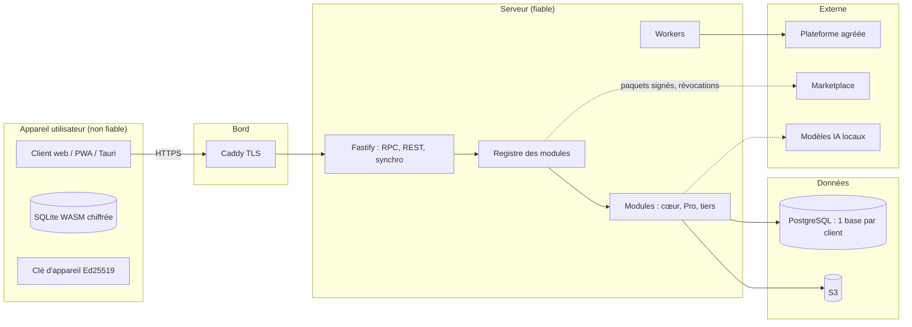

# Modèle de menace — cœur de Socle ERP (STRIDE)

- **Version** : 0.1 — 2026-09-28 (phase 0, avant tout code applicatif)
- **Révision ciblée** : 2026-10-02 — adaptateur RPC, métadonnées et parcours de session du client web (§3.9–3.11).
- **Responsable** : Messaoudene Mehdi
- **Révision** : à chaque nouveau module, à chaque changement de surface d'attaque, et avant chaque release (`ARCHITECTURE.md` §9.5).
- **Référentiels** : OWASP ASVS 5.0 niveau 2 (tout le produit), niveau 3 (authentification, synchro, santé, caisse).

## 1. Périmètre et actifs

| Actif | Classification | Pourquoi il compte |
|---|---|---|
| Données métier d'un client (factures, stock, contacts) | Interne / personnelle | Cœur de valeur ; obligations RGPD / loi 18-07 modifiée par la loi 25-11 |
| Données `sensitive` (santé, IBAN, pièces d'identité) | Sensible | Préjudice élevé ; HDS pour la santé |
| Registres comptables, numérotation légale, journal d'audit | Intégrité critique | Valeur probante (FEC, ISCA, conservation 10 ans) |
| Identifiants, sessions, clés d'appareil (Ed25519) | Secret | Prise de contrôle de comptes et d'appareils |
| Clés de signature (marketplace, licences Pro, releases) | Secret critique | Compromission de tout l'écosystème |
| Base locale chiffrée du client hors ligne | Sensible | Vol ou perte d'appareil |
| Code du cœur et chaîne de build | Intégrité critique | Attaque de la chaîne d'approvisionnement |

## 2. Frontières de confiance

Frontières : **(F1)** appareil ↔ serveur ; **(F2)** client A ↔ client B (multi-tenant) ; **(F3)** cœur ↔ module tiers ; **(F4)** serveur ↔ services externes ; **(F5)** développeur ↔ chaîne de build et de publication ; **(F6)** donnée récupérée ↔ modèle IA.

## 3. Analyse STRIDE par composant

Légende de gravité : **C** critique, **É** élevée, **M** moyenne, **F** faible. « Phase » = phase où la mesure est livrée.

### 3.1 Client hors ligne (F1)

| STRIDE | Menace | Grav. | Mesures | Phase |
|---|---|---|---|---|
| S | Usurpation d'un appareil pour pousser des mutations | C | Clé Ed25519 par appareil, enregistrement de l'appareil, signature de chaque mutation, révocation | 1 |
| T | Modification de la base locale pour contourner les règles métier | É | Le serveur **rejoue et revalide** chaque mutation (droits, contraintes, règles) ; aucune décision de droit côté client | 1 |
| R | Contestation d'une action faite hors ligne | M | Mutations signées + journal d'audit chaîné par hachage | 1–2 |
| I | Vol de l'appareil → lecture des données | É | Base chiffrée, clé dérivée à la connexion, jamais stockée en clair ; durée maximale hors ligne ; champs `sensitive` / `offline: false` jamais répliqués | 1 (spike O5) |
| I | Réplique contenant plus que les droits de l'utilisateur | É | Pull filtré côté serveur par ACL + règles ; évictions quand les droits sont retirés | 1 |
| D | Appareil qui inonde le serveur de mutations | M | Rate limiting par appareil et par utilisateur, taille de lot bornée | 1 |
| E | Exécution hors ligne d'une méthode serveur (numérotation légale, compta) | É | Séparation `methods` / `serverMethods` ; les secondes sont seulement mises en file | 1 |

### 3.2 Synchronisation (F1)

| STRIDE | Menace | Grav. | Mesures | Phase |
|---|---|---|---|---|
| S | Rejeu d'une mutation capturée | É | `mutationId` UUIDv7 idempotent, horodatage, signature | 1 |
| T | Conflit résolu en écrasant silencieusement une donnée | É | `decideConflict()` pure et testée ; **archivage systématique de la version perdante** ; politique `manual` pour les données critiques | 1 |
| T | Échec de lecture interprété comme base vide → suppression massive | C | Garde-fou : une erreur de lecture n'est jamais une base vide (tests) | 1 |
| I | Fuite d'enregistrements via les curseurs ou les évictions | M | Curseurs opaques, évictions sans contenu | 1 |
| D | Divergence durable des répliques | M | Tests de propriétés fast-check (convergence quel que soit l'ordre) | 1 |

### 3.3 Serveur, API et authentification

| STRIDE | Menace | Grav. | Mesures | Phase |
|---|---|---|---|---|
| S | Vol de session, bourrage d'identifiants | É | argon2id, MFA TOTP, passkeys, verrouillage progressif, mots de passe compromis (k-anonymat), cookies `HttpOnly`/`Secure`/`SameSite=Lax`, rotation d'identifiant | 2 |
| T | Injection SQL | C | Kysely uniquement, `sql` gabarit revu, noms de colonnes en liste blanche ; règle Semgrep `socle-no-raw-sql` | 0 (contrôle) / 1 |
| T | XSS via champs `html` | É | DOMPurify, CSP stricte avec nonces + Trusted Types ; règle ESLint/Semgrep contre `dangerouslySetInnerHTML` | 0 (contrôle) / 2 |
| R | Action sensible non tracée | M | Journal d'audit chaîné ; `env.sudo()` journalisé | 1–2 |
| I | SSRF via webhooks, import d'URL, modules | É | Client HTTP unique à liste blanche d'hôtes | 1 |
| I | Fuite de données personnelles dans les logs | M | Redaction pino, attribut `sensitive` | 1 |
| D | Épuisement de ressources | M | Rate limiting token bucket, limites de taille, timeouts | 1 |
| E | Contournement d'ACL par un appel RPC direct | C | Refus par défaut, ordre CORS → rate limit → parse → validate → authN → authZ → action, RLS PostgreSQL en seconde ligne | 1 |

### 3.4 Multi-client (F2)

| STRIDE | Menace | Grav. | Mesures | Phase |
|---|---|---|---|---|
| I | Lecture de la base d'un autre client | C | Une base par client, résolution par sous-domaine, pool **par base**, tests automatisés d'isolation croisée | 1 |
| T | Confusion de tenant dans un worker | É | Identifiant de base porté explicitement par chaque tâche pg-boss, vérifié à l'exécution | 2 |
| E | Opérateur SaaS abusant de ses accès | M | Accès d'administration journalisés, principe du moindre privilège | 4 |

### 3.5 Modules tiers et marketplace (F3)

| STRIDE | Menace | Grav. | Mesures | Phase |
|---|---|---|---|---|
| S | Module se faisant passer pour un éditeur légitime | C | Double signature Ed25519 éditeur + marketplace, vérifiée hors ligne | 1 |
| T | Module modifié après signature | C | Vérification de signature à l'installation et au chargement | 1 |
| I | Module exfiltrant des données | C | Manifeste de `capabilities`, réseau via client à liste blanche, revue humaine des capacités sensibles | 1 / 6 |
| E | Module utilisant `sudo` ou des API internes | É | API publique `@public` seule (lint + API Extractor), capacité `sudo` déclarée et affichée | 1 |
| D | Module compromis déjà installé | É | Liste de révocation signée consultée à chaque synchro ; instantané avant installation | 1 |

Hypothèse assumée : un module installé s'exécute dans le même processus que le cœur (comme Odoo). Les capacités réduisent l'exposition mais **ne sont pas un bac à sable** ; la confiance repose sur la signature, l'analyse et la revue.

### 3.6 Clés Pro et licences

| STRIDE | Menace | Grav. | Mesures | Phase |
|---|---|---|---|---|
| S | Clé de licence forgée | M | Signature Ed25519 vérifiée hors ligne ; clé privée hors dépôt, hors CI publique | 1 |
| T | Modification du code de vérification | F | Accepté (§5.3 de l'architecture) : protection juridique et commerciale, pas d'obfuscation | — |
| I | Fuite de la clé privée de signature | C | Stockage hors ligne ou coffre, jamais dans un dépôt ; rotation documentée | 4 |

### 3.7 IA souveraine (F6, module Pro)

| STRIDE | Menace | Grav. | Mesures | Phase |
|---|---|---|---|---|
| I | Le RAG renvoie des documents que l'utilisateur ne peut pas lire | C | Récupération filtrée par les mêmes ACL et règles | Pro |
| E | Injection de prompt déclenchant des outils MCP | É | Contenu récupéré traité comme donnée ; outils exécutés **avec l'identité de l'utilisateur** ; confirmation pour les actions d'écriture | Pro |
| I | Envoi de données vers un service externe | É | Aucun appel sortant ; modèles locaux | Pro |

### 3.8 Chaîne d'approvisionnement (F5)

| STRIDE | Menace | Grav. | Mesures | Phase |
|---|---|---|---|---|
| T | Paquet npm piégé | C | `minimumReleaseAge` 7 jours, `trustPolicy: no-downgrade`, `blockExoticSubdeps`, scripts d'installation refusés (`allowBuilds`), lockfile gelé, OSV-Scanner | **0 (fait)** |
| T | Action GitHub compromise | É | Actions épinglées par SHA, `contents: read` par défaut, binaires d'outils vérifiés par SHA-256 | **0 (fait)** |
| T | Workflow `pull_request_target` exécutant du code de PR | C | Le workflow CLA ne récupère jamais le code de la PR ; entrées non fiables passées par variables d'environnement ; CodeQL analyse les workflows | **0 (fait)** |
| T | Commit non authentifié sur `main` | É | Ruleset : commits signés, PR obligatoire, checks requis, pas de force-push | **0 (fait)** |
| I | Secret poussé dans le dépôt | É | Push protection, secret scanning, gitleaks (hook + CI) | **0 (fait)** |
| T | Release falsifiée | É | SBOM, provenance, images signées cosign, Trivy (`release.yml`, activé en phase 4) | 4 |

### 3.9 Adaptateur RPC du client web (F1, lot 2.3)

L’adaptateur `apps/web/src/rpc-data-source.ts` utilise la session déjà ouverte sur la même origine. Le catalogue est fourni par l’application ou chargé depuis le serveur (§3.10) ; il n’accorde aucun droit. Les ACL, règles de société et contrôles de champs restent appliqués par les routes RPC et l’ORM serveur.

| STRIDE | Menace | Grav. | Mesures livrées | Phase |
|---|---|---|---|---|
| S / I | Une ancienne fiche utilise la session d’un autre utilisateur | É | Jeton CSRF lié à la session, conservé en mémoire ; fermeture sur 401 ou refus CSRF ; aucun renouvellement ni rejeu transparent ; nouvelle source et nouvelles vues après changement de contexte | 2.3 |
| I | Envoi de la session vers une autre origine ou une redirection | É | Routes relatives fixes, modèles connus du registre, `mode` et `credentials` à `same-origin`, redirections refusées, cache HTTP désactivé | 2.3 |
| T / I | Réponse tardive ou mal formée affichée après fermeture | É | Annulation et rejet des réponses tardives, validation Zod, projection des seuls champs demandés, rejet des identifiants dupliqués ou non sollicités | 2.3 |
| T | Une coupure réseau déclenche une seconde écriture | É | Aucun nouvel essai automatique ; résultat incertain signalé ; relecture avant décision de réessayer | 2.3 |
| I | Affichage de détails internes provenant d’une erreur réseau ou serveur | M | Codes contrôlés et messages locaux FR/EN/AR ; aucun message brut ni détail par champ déduit du texte serveur | 2.3 |

Tests : `apps/web/src/rpc-data-source.test.ts` pour le transport et son cycle de vie ; `packages/testing/acceptance/src/web-rpc.test.ts` pour les vraies routes Fastify, PostgreSQL, l’audit et l’isolation entre sociétés et bases.

Limites de ce lot : `dispose()` n’annule pas une transaction déjà acceptée par le serveur. L’application démonte les anciennes vues lors d’un changement d’identité ; le choix de société et le raccordement à la réplique chiffrée restent à livrer. Cet adaptateur ne constitue pas une file d’attente hors ligne. Le parcours de connexion est décrit au §3.11.

### 3.10 Catalogue de métadonnées du client web (F1, lot 2.3)

`POST /web/metadata` publie un instantané versionné des modèles et vues `form/list` du tenant pour l’utilisateur authentifié. La projection utilise ses groupes effectifs et les ACL de lecture, puis ferme les références vers les champs et modèles retirés. Les règles d’enregistrement restent exclusivement côté serveur.

| STRIDE | Menace | Grav. | Mesures livrées | Phase |
|---|---|---|---|---|
| I | Exposition de champs interdits, de règles internes ou de code de module | É | Projection explicite des seuls attributs publics, filtrage des groupes et ACL, retrait des références cachées dans les vues, relations et devises ; aucune valeur par défaut, définition de calcul, contrainte ou règle sérialisée | 2.3 |
| S / I | Métadonnées et données chargées sous deux sessions différentes | É | Un seul chargement de session ; POST des métadonnées et RPC liés au même jeton CSRF ; identité de la réponse comparée ; aucune reprise transparente | 2.3 |
| T / E | Un catalogue modifié dans le navigateur accorde des droits | É | Capacités purement indicatives ; ACL, règles de lignes et contrôles des champs réappliqués par le serveur à chaque opération | 2.3 |
| I | Projection d’un autre utilisateur réutilisée | É | Projection par requête, tenant résolu par le serveur, réponse `no-store`, aucun cache de projection partagé | 2.3 |
| T / D | Métadonnées mal formées ou arbre excessivement profond | M | Schémas Zod stricts, version et références validées, limites sur les collections et la profondeur avant hydratation ; aucune reconstruction de classes exécutables | 2.3 |

Tests : projection et validation pures dans `packages/framework/src/metadata/`, cycle de connexion dans `apps/web/src/web-client.test.ts`, isolation et droits avec PostgreSQL réel dans `packages/testing/acceptance/src/web-metadata.test.ts`.

Limites : le catalogue représente les droits au moment du chargement, pas une autorisation durable. Tout changement de session ou de société exige une nouvelle connexion et le démontage des anciennes vues. Un retrait de droit reste appliqué immédiatement par le serveur aux opérations suivantes. Les menus, les actions métier et les autres types de vues restent hors de cette première version du protocole.

### 3.11 Écran d’authentification et session web (F1, lot 2.3)

L’écran utilise les routes d’authentification existantes sur la même origine. Les défis, mots de passe, clés d’inscription TOTP et codes de secours restent seulement en mémoire de la page. Le serveur conserve toutes les décisions d’authentification et d’autorisation.

| STRIDE | Menace | Grav. | Mesures livrées | Phase |
|---|---|---|---|---|
| S / I | Ancien cookie restauré pendant un défi MFA OIDC | É | Fragment strictement validé puis retiré avant rendu ; aucun chargement de session pendant le défi ; nouvelle source après authentification terminée | 2.3 |
| I | Mot de passe, défi ou codes de secours persistés ou exposés dans des erreurs | É | Aucun stockage navigateur, journal ou télémétrie ; messages locaux contrôlés ; codes montrés une seule fois avec acquittement explicite avant ouverture des vues | 2.3 |
| T / S | Réponse d’une ancienne connexion ou déconnexion appliquée à un nouveau contexte | É | Annulation transport, scopes React par client/runtime, générations de connexion, source périmée fermée et démontée ; sérialisation déconnexion/reconnexion, aucune relance automatique | 2.3 |
| S / E | Fournisseur ou facteur non configuré proposé comme fonction active | M | Fournisseurs publics validés, découverte vide sans OIDC ; seules méthodes du défi proposées ; passkey native en contexte sécurisé, options et réponse validées | 2.3 |
| T | Perte silencieuse d’un brouillon lors d’un changement de vue | M | État agrégé des cartes, dialogue d’abandon, garde pendant la sauvegarde, avertissement natif de fermeture quand disponible ; aucune sauvegarde implicite | 2.3 |

Tests : transport, WebAuthn et écrans dans `apps/web/src/`, notamment remplacement de client et déconnexions concurrentes ; suite `packages/testing/acceptance/src/browser/` avec PostgreSQL, cookies `Secure`/`HttpOnly` réels dans Chromium, droits de lecteur et expiration active. Le proxy de cette fixture écoute seulement en boucle locale, avec un tenant de démonstration fixe, et ne charge aucun fichier de secrets.

Limites : les tests de passkey simulent l’authentificateur natif et ne remplacent pas la validation avec un appareil physique ; les callbacks OIDC sont testés sans fournisseur externe. Le client reste en ligne, sans persistance des brouillons ni réplique locale. Le déploiement devra fournir une politique CSP HTML adaptée aux fichiers statiques sous la même origine HTTPS ; les en-têtes API ne sont pas affaiblis par ce lot.

### 3.12 Conversations et activités (F1, premier lot 2.4)

Les routes `/mail/` reprennent le pipeline HTTP, le tenant, la session/CSRF et la transaction auditée. Les tables privées refusent les RPC génériques ; les services utilisent un `sudo` motivé seulement après vérification des droits sur le parent.

| STRIDE | Menace | Grav. | Mesures livrées | Phase |
|---|---|---|---|---|
| I / E | Accès à un fil d’une autre société ou par un identifiant arbitraire | É | Parent réel portant `mail.thread`, recherche sous ACL et règles courantes avant chaque opération ; aucun accès RPC direct aux tables privées ; réplique générique désactivée | 2.4 |
| S / T | Auteur, société, responsable ou abonné usurpé | É | Identités et société dérivées côté serveur ; schémas stricts sans ces paramètres ; activités et abonnements personnels | 2.4 |
| I | Note interne ou valeur confidentielle dans le suivi, l’export ou une notification | É | Groupes effectifs exigés pour les notes ; exclusion des champs sensibles, restreints et relationnels à l’écriture et à la lecture/export ; notification sans extrait, droits du parent revérifiés | 2.4 |
| T | Double achèvement ou message séparé d’une écriture échouée | M | Verrou du parent, transition depuis `planned` uniquement, message et notification dans la même transaction ; hook après validation ; aucun rejeu automatique côté client | 2.4 |
| E / T | Script dans un message ou brouillon perdu à la navigation | M | Texte borné rendu par React ; brouillons conservés dans les onglets masqués et inclus dans la garde de navigation | 2.4 |
| I | Données personnelles conservées dans les messages après anonymisation du contact | É | Hook transactionnel après contrôles de conservation de `base`, effacement du texte et du suivi, annulation des activités, retrait des abonnements et notifications ; exception auditée à l’immutabilité | 2.4 |

Tests : `modules/mail/tests/mail.test.ts`, transports et composants, ainsi que `packages/testing/acceptance/src/browser/` avec PostgreSQL et cookies réels. Limites et plafonds : [module mail](../../modules/mail/README.md). Le SMTP, les rappels, les mentions et une réplique filtrée par parent restent à livrer ; aucune intégration externe n’est simulée comme disponible.

## 4. Risques résiduels suivis

| # | Risque | Traitement |
|---|---|---|
| R1 | Dépôt privé `socle-erp-pro` sans ruleset (offre GitHub gratuite) | CI (gitleaks, Semgrep) + discipline ; réévaluer si passage à GitHub Pro |
| R2 | Modules exécutés dans le même processus que le cœur | Signature + revue + capacités ; étudier l'isolation (worker threads) après la V1 |
| R3 | Chiffrement de la base locale non encore choisi | Spike ADR 007 en phase 1 |
| R4 | Clé de licence contournable par modification du code | Accepté (modèle Odoo) |
| R5 | Textes juridiques (CLA, licence Pro) non validés | Validation par un juriste avant toute vente |
