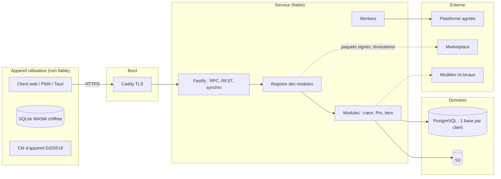

# Modèle de menace — cœur de Socle ERP (STRIDE)

- **Version** : 0.1 — 2026-09-28 (phase 0, avant tout code applicatif)
- **Responsable** : Messaoudene Mehdi
- **Révision** : à chaque nouveau module, à chaque changement de surface d'attaque, et avant chaque release (`ARCHITECTURE.md` §9.5).
- **Référentiels** : OWASP ASVS 5.0 niveau 2 (tout le produit), niveau 3 (authentification, synchro, santé, caisse).

## 1. Périmètre et actifs

| Actif | Classification | Pourquoi il compte |
|---|---|---|
| Données métier d'un client (factures, stock, contacts) | Interne / personnelle | Cœur de valeur ; obligations RGPD / loi 18-07 modifiée par la loi 25-11 |
| Données `sensitive` (santé, IBAN, pièces d'identité) | Sensible | Préjudice élevé ; HDS pour la santé |
| Registres comptables, numérotation légale, journal d'audit | Intégrité critique | Valeur probante (FEC, ISCA, conservation 10 ans) |
| Identifiants, sessions, clés d'appareil (Ed25519) | Secret | Prise de contrôle de comptes et d'appareils |
| Clés de signature (marketplace, licences Pro, releases) | Secret critique | Compromission de tout l'écosystème |
| Base locale chiffrée du client hors ligne | Sensible | Vol ou perte d'appareil |
| Code du cœur et chaîne de build | Intégrité critique | Attaque de la chaîne d'approvisionnement |

## 2. Frontières de confiance

Frontières : **(F1)** appareil ↔ serveur ; **(F2)** client A ↔ client B (multi-tenant) ; **(F3)** cœur ↔ module tiers ; **(F4)** serveur ↔ services externes ; **(F5)** développeur ↔ chaîne de build et de publication ; **(F6)** donnée récupérée ↔ modèle IA.

## 3. Analyse STRIDE par composant

Légende de gravité : **C** critique, **É** élevée, **M** moyenne, **F** faible. « Phase » = phase où la mesure est livrée.

### 3.1 Client hors ligne (F1)

| STRIDE | Menace | Grav. | Mesures | Phase |
|---|---|---|---|---|
| S | Usurpation d'un appareil pour pousser des mutations | C | Clé Ed25519 par appareil, enregistrement de l'appareil, signature de chaque mutation, révocation | 1 |
| T | Modification de la base locale pour contourner les règles métier | É | Le serveur **rejoue et revalide** chaque mutation (droits, contraintes, règles) ; aucune décision de droit côté client | 1 |
| R | Contestation d'une action faite hors ligne | M | Mutations signées + journal d'audit chaîné par hachage | 1–2 |
| I | Vol de l'appareil → lecture des données | É | Base chiffrée, clé dérivée à la connexion, jamais stockée en clair ; durée maximale hors ligne ; champs `sensitive` / `offline: false` jamais répliqués | 1 (spike O5) |
| I | Réplique contenant plus que les droits de l'utilisateur | É | Pull filtré côté serveur par ACL + règles ; évictions quand les droits sont retirés | 1 |
| D | Appareil qui inonde le serveur de mutations | M | Rate limiting par appareil et par utilisateur, taille de lot bornée | 1 |
| E | Exécution hors ligne d'une méthode serveur (numérotation légale, compta) | É | Séparation `methods` / `serverMethods` ; les secondes sont seulement mises en file | 1 |

### 3.2 Synchronisation (F1)

| STRIDE | Menace | Grav. | Mesures | Phase |
|---|---|---|---|---|
| S | Rejeu d'une mutation capturée | É | `mutationId` UUIDv7 idempotent, horodatage, signature | 1 |
| T | Conflit résolu en écrasant silencieusement une donnée | É | `decideConflict()` pure et testée ; **archivage systématique de la version perdante** ; politique `manual` pour les données critiques | 1 |
| T | Échec de lecture interprété comme base vide → suppression massive | C | Garde-fou : une erreur de lecture n'est jamais une base vide (tests) | 1 |
| I | Fuite d'enregistrements via les curseurs ou les évictions | M | Curseurs opaques, évictions sans contenu | 1 |
| D | Divergence durable des répliques | M | Tests de propriétés fast-check (convergence quel que soit l'ordre) | 1 |

### 3.3 Serveur, API et authentification

| STRIDE | Menace | Grav. | Mesures | Phase |
|---|---|---|---|---|
| S | Vol de session, bourrage d'identifiants | É | argon2id, MFA TOTP, passkeys, verrouillage progressif, mots de passe compromis (k-anonymat), cookies `HttpOnly`/`Secure`/`SameSite=Lax`, rotation d'identifiant | 2 |
| T | Injection SQL | C | Kysely uniquement, `sql` gabarit revu, noms de colonnes en liste blanche ; règle Semgrep `socle-no-raw-sql` | 0 (contrôle) / 1 |
| T | XSS via champs `html` | É | DOMPurify, CSP stricte avec nonces + Trusted Types ; règle ESLint/Semgrep contre `dangerouslySetInnerHTML` | 0 (contrôle) / 2 |
| R | Action sensible non tracée | M | Journal d'audit chaîné ; `env.sudo()` journalisé | 1–2 |
| I | SSRF via webhooks, import d'URL, modules | É | Client HTTP unique à liste blanche d'hôtes | 1 |
| I | Fuite de données personnelles dans les logs | M | Redaction pino, attribut `sensitive` | 1 |
| D | Épuisement de ressources | M | Rate limiting token bucket, limites de taille, timeouts | 1 |
| E | Contournement d'ACL par un appel RPC direct | C | Refus par défaut, ordre CORS → rate limit → parse → validate → authN → authZ → action, RLS PostgreSQL en seconde ligne | 1 |

### 3.4 Multi-client (F2)

| STRIDE | Menace | Grav. | Mesures | Phase |
|---|---|---|---|---|
| I | Lecture de la base d'un autre client | C | Une base par client, résolution par sous-domaine, pool **par base**, tests automatisés d'isolation croisée | 1 |
| T | Confusion de tenant dans un worker | É | Identifiant de base porté explicitement par chaque tâche pg-boss, vérifié à l'exécution | 2 |
| E | Opérateur SaaS abusant de ses accès | M | Accès d'administration journalisés, principe du moindre privilège | 4 |

### 3.5 Modules tiers et marketplace (F3)

| STRIDE | Menace | Grav. | Mesures | Phase |
|---|---|---|---|---|
| S | Module se faisant passer pour un éditeur légitime | C | Double signature Ed25519 éditeur + marketplace, vérifiée hors ligne | 1 |
| T | Module modifié après signature | C | Vérification de signature à l'installation et au chargement | 1 |
| I | Module exfiltrant des données | C | Manifeste de `capabilities`, réseau via client à liste blanche, revue humaine des capacités sensibles | 1 / 6 |
| E | Module utilisant `sudo` ou des API internes | É | API publique `@public` seule (lint + API Extractor), capacité `sudo` déclarée et affichée | 1 |
| D | Module compromis déjà installé | É | Liste de révocation signée consultée à chaque synchro ; instantané avant installation | 1 |

Hypothèse assumée : un module installé s'exécute dans le même processus que le cœur (comme Odoo). Les capacités réduisent l'exposition mais **ne sont pas un bac à sable** ; la confiance repose sur la signature, l'analyse et la revue.

### 3.6 Clés Pro et licences

| STRIDE | Menace | Grav. | Mesures | Phase |
|---|---|---|---|---|
| S | Clé de licence forgée | M | Signature Ed25519 vérifiée hors ligne ; clé privée hors dépôt, hors CI publique | 1 |
| T | Modification du code de vérification | F | Accepté (§5.3 de l'architecture) : protection juridique et commerciale, pas d'obfuscation | — |
| I | Fuite de la clé privée de signature | C | Stockage hors ligne ou coffre, jamais dans un dépôt ; rotation documentée | 4 |

### 3.7 IA souveraine (F6, module Pro)

| STRIDE | Menace | Grav. | Mesures | Phase |
|---|---|---|---|---|
| I | Le RAG renvoie des documents que l'utilisateur ne peut pas lire | C | Récupération filtrée par les mêmes ACL et règles | Pro |
| E | Injection de prompt déclenchant des outils MCP | É | Contenu récupéré traité comme donnée ; outils exécutés **avec l'identité de l'utilisateur** ; confirmation pour les actions d'écriture | Pro |
| I | Envoi de données vers un service externe | É | Aucun appel sortant ; modèles locaux | Pro |

### 3.8 Chaîne d'approvisionnement (F5)

| STRIDE | Menace | Grav. | Mesures | Phase |
|---|---|---|---|---|
| T | Paquet npm piégé | C | `minimumReleaseAge` 7 jours, `trustPolicy: no-downgrade`, `blockExoticSubdeps`, scripts d'installation refusés (`allowBuilds`), lockfile gelé, OSV-Scanner | **0 (fait)** |
| T | Action GitHub compromise | É | Actions épinglées par SHA, `contents: read` par défaut, binaires d'outils vérifiés par SHA-256 | **0 (fait)** |
| T | Workflow `pull_request_target` exécutant du code de PR | C | Le workflow CLA ne récupère jamais le code de la PR ; entrées non fiables passées par variables d'environnement ; CodeQL analyse les workflows | **0 (fait)** |
| T | Commit non authentifié sur `main` | É | Ruleset : commits signés, PR obligatoire, checks requis, pas de force-push | **0 (fait)** |
| I | Secret poussé dans le dépôt | É | Push protection, secret scanning, gitleaks (hook + CI) | **0 (fait)** |
| T | Release falsifiée | É | SBOM, provenance, images signées cosign, Trivy (`release.yml`, activé en phase 4) | 4 |

## 4. Risques résiduels suivis

| # | Risque | Traitement |
|---|---|---|
| R1 | Dépôt privé `socle-erp-pro` sans ruleset (offre GitHub gratuite) | CI (gitleaks, Semgrep) + discipline ; réévaluer si passage à GitHub Pro |
| R2 | Modules exécutés dans le même processus que le cœur | Signature + revue + capacités ; étudier l'isolation (worker threads) après la V1 |
| R3 | Chiffrement de la base locale non encore choisi | Spike ADR 007 en phase 1 |
| R4 | Clé de licence contournable par modification du code | Accepté (modèle Odoo) |
| R5 | Textes juridiques (CLA, licence Pro) non validés | Validation par un juriste avant toute vente |
